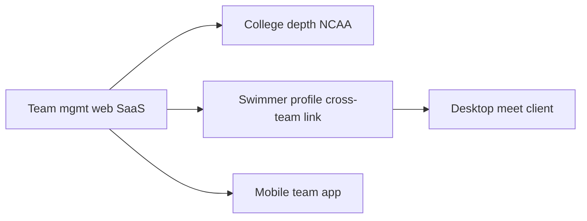

# Project Aqua — Team Management v1 PRD

**Status:** Draft (grill-me rounds 1–2 complete)  
**Product:** Project Aqua  
**Scope:** Visiting-team coach SaaS — team management first, meet hosting later  
**Audience:** Product, engineering, agents preparing `/to-spec`  
**Last updated:** 2026-08-29

---

## Problem Statement

Swim coaches who manage competitive teams spend a disproportionate amount of time on administrative work that existing software handles poorly. A head coach who works both a high school program and a year-round club team must maintain separate rosters, re-enter the same swimmer data across desktop tools, manually track best times in spreadsheets, and rebuild meet lineups from scratch for every invitational. When the meet host sends an event file, the coach exports entries in Hy-Tek format, emails or uploads the pack, then manually merges results back into team records after the meet.

Legacy tools like Hy-Tek Team Manager remain the de facto standard for file interchange, but they require Windows installations, paid licenses that expire, and offer no coherent experience for coaches who belong to multiple programs. Modern alternatives optimize for different buyers: SwimTopia and SportsEngine Motion target club administrators with registration, billing, and volunteer workflows; SwimCloud bundles team management with meet hosting and paywalls basic entry efficiency behind a Pro tier; CommitSwimming offers a full product but starts at roughly $39/month with no free tier.

Coaches are left choosing between software built for club ops, software built for meet directors, or spreadsheets. None of these options treat the **visiting coach's daily workflow**—roster, entries, results, progression across programs—as the primary job to be done.

---

## Solution

Project Aqua is a modern, web-based team management platform built **coach-first**. Coaches manage swimmers on one or more teams from a single login, import rosters and meet files in industry-standard formats, build meet lineups with auto-populated seed times, export entry packs that hosts accept in Hy-Tek Meet Manager / SwimTopia / SwimCloud / TeamUnify, import results after meets, and track swimmer progression within each team and season.

v1 focuses exclusively on **visiting-team** workflows: the coach prepares their team's entries and consumes results from meets they attend. Host-side meet merge, timing consoles, and desktop meet management are explicitly deferred. The platform supports club, high school, college, and summer segments from a unified UX shell, with segment-specific depth phased so each audience gets a credible v1 without blocking others.

**Positioning statement:**

> Modern, coach-first team management for swimmers across club, high school, and college programs—one login for coaches who work multiple teams, bulletproof Hy-Tek/SDIF interchange, and honest progression tracking—with a credible path to meet management later.

---

## User Stories

### Epic A — Multi-team coach workspace

1. As a head coach who works both a club team and a high school team, I want to switch between teams without signing out, so that I can manage both programs in one session.
2. As a head coach, I want to see a dashboard of upcoming meets across all my teams, so that I can plan my week without checking separate tools.
3. As a head coach, I want to invite assistant coaches to a specific team with a defined role, so that they can help with entries without accessing billing or other teams.
4. As an assistant coach, I want to edit meet entries on teams where I have permission, so that I can support the head coach during entry deadlines.
5. As an assistant coach, I want to be prevented from importing/exporting meet files or changing team settings when my role does not allow it, so that sensitive operations stay with the head coach.
6. As a head coach, I want to create a new team and complete onboarding (team type, season, basic settings), so that I can stand up a program quickly at the start of a season.
7. As a head coach, I want the URL and navigation to reflect my active team context, so that I always know which program I am editing.
8. As a coach with access to multiple teams, I want roster and meet data strictly isolated between teams, so that I never accidentally edit the wrong program.
9. As a head coach, I want to remove a coach from my team, so that departed staff lose access immediately.
10. As a head coach, I want to transfer ownership of a team to another coach, so that program leadership changes are handled cleanly.

### Epic B — Roster management

11. As a head coach, I want to add a swimmer manually with name, date of birth, gender, and segment-specific fields, so that I can build a roster without importing a file.
12. As a head coach of a USA Swimming club team, I want to record a swimmer's USA Swimming ID on their membership, so that SWIMS sync and future compliance workflows have the correct identifier.
13. As a head coach of a high school team, I want to record class year (freshman through senior) on a swimmer's season enrollment, so that I can organize and report by grade.
14. As a head coach of a college team, I want to record eligibility year on a swimmer's enrollment, so that I can track NCAA eligibility context.
15. As a head coach, I want to assign swimmers to training groups within a season, so that I can organize practice cohorts (varsity, age group, etc.).
16. As a head coach, I want to import a roster from a CSV file, so that I can migrate from a spreadsheet or another system's export.
17. As a head coach, I want to import a roster from a Hy-Tek CL2/HY3 roster pack, so that I can migrate from Team Manager without retyping swimmers.
18. As a head coach of a club team, I want to sync my roster with USA Swimming SWIMS 3.0 on the free tier, so that my team stays current with national membership data without paying for basic club viability.
19. As a head coach, I want to archive a swimmer who leaves the team, so that historical data is preserved but they no longer appear on the active roster.
20. As a head coach, I want to reactivate an archived swimmer for a new season, so that returning athletes do not require duplicate records.
21. As a head coach, I want to edit a swimmer's membership details (group, class year, contacts) without affecting their global identity record, so that team-specific data stays scoped correctly.
22. As a head coach, I want to export my roster to CSV, so that I can share a snapshot with staff or backup my data.
23. As a head coach, I want to see how many active swimmers are on my roster, so that I can confirm headcount before a meet.
24. As a head coach onboarding a new team, I want import errors surfaced with row-level feedback, so that I can fix bad data without silently dropping swimmers.
25. As a head coach of a club team subject to SafeSport/MAAPP rules, I want minor swimmer PII gated behind credential verification, so that the platform meets compliance expectations.

### Epic C — Meet workflow (visiting team)

26. As a head coach, I want to add a meet to my team's schedule manually, so that I can track meets even before I have an event file from the host.
27. As a head coach, I want to import a meet event file (EV3, HYV, or ZIP pack) from the host, so that events, sessions, qualifying times, and divisions are set up automatically.
28. As a head coach, I want dive events detected but skipped during swim import, so that swim-only teams are not blocked by combined swim/dive meets.
29. As a head coach, I want to declare which swimmers from my roster are attending a meet, so that only attending athletes appear in the entry workflow.
30. As a head coach, I want to include relay-only swimmers on the meet roster (swimmers with no individual events), so that hosts receive a complete team entry per SwimCloud/Hy-Tek expectations.
31. As a head coach, I want to assign relay alternates (#5–#8) on the meet roster, so that championship meets accept my full relay designation.
32. As a head coach, I want to enter a swimmer into individual events with seed time, exhibition flag, and entry notes, so that I can build a complete lineup.
33. As a head coach, I want seed times auto-populated from my team's best-time database when I add an entry, so that I do not manually retype times for every event (free tier).
34. As a head coach, I want to override an auto-populated seed time when my swimmer has a newer unrecorded time, so that entries reflect reality.
35. As a head coach, I want to build relay teams and assign four legs (plus alternates where required), so that relay entries export correctly.
36. As a head coach, I want to see best relay splits when assigning legs, so that I can compose competitive relay lineups.
37. As a head coach on the Pro tier, I want lineup suggestions that recommend a strong overall team lineup given entry limits and qualifying times, so that I save time before championship meets.
38. As a head coach, I want validation errors when a swimmer exceeds per-meet or per-day entry limits, so that I fix problems before exporting.
39. As a head coach, I want validation warnings when a seed time does not meet a meet's qualifying time (QT) cut, so that I know which entries may be rejected by the host.
40. As a head coach, I want to scratch an approved entry without deleting it, so that late scratches are tracked in the entry history.
41. As a head coach, I want to review entries grouped by swimmer, by event, or by validation errors, so that I can efficiently audit the lineup before submission.
42. As a head coach, I want to export my meet entries as a HY3/CL2 dual pack, so that Hy-Tek Meet Manager hosts accept my submission.
43. As a head coach, I want to export meet entries as SDIF (.sd3), so that TeamUnify or SwimTopia hosts accept my submission.
44. As a head coach, I want exported files to import successfully into Hy-Tek Meet Manager, SwimTopia, and SwimCloud without manual repair, so that hosts do not reject my team's entries.
45. As a head coach, I want to import meet results (HY3/CL2/ZIP) after a meet, so that times flow back into my team database automatically.
46. As a head coach, I want legacy results files (CL2-only, no split records) to import correctly, so that older meets are not lost.
47. As a head coach, I want modern results files (D0 times with G0 splits) to import correctly, so that split data is preserved where available.
48. As a head coach, I want imported results to update swimmer best times when the new time is faster, so that progression stays current without manual entry.
49. As a head coach, I want to see which entries matched which results after import, so that I can resolve unmatched swims.
50. As a head coach, I want meet entry and export operations restricted to head coach and owner roles, so that only authorized staff mutate interchange files.
51. As a head coach preparing for the Sonoran Desert Invitational, I want to import the host event file, enter my club lineup, export entries, and later import results—the full cycle that my real-world files require.
52. As a head coach preparing for an HS invitational (Croswhite, Charger), I want JV/Varsity division events from the host file respected in my entry workflow, so that high school meets work out of the box.
53. As a head coach, I want to print or download an entry report before exporting, so that I can do a final paper review with staff.

### Epic D — Progression and times

54. As a head coach, I want to see each swimmer's best times by course (SCY, SCM, LCM) and event, so that I can make informed entry decisions.
55. As a head coach, I want to see season progression charts for a swimmer on my team, so that I can show improvement over the current season.
56. As a head coach, I want to manually add a time entry for a swimmer (e.g., from a time trial not yet in a results file), so that my best-time database stays complete.
57. As a head coach, I want to import best times from CSV, so that I can bulk-load historical data at season start.
58. As a head coach, I want to track time standards and cuts (qualifying, motivational, team records) against swimmer times, so that I know who is close to a cut.
59. As a head coach, I want progression scoped to the current team and season in v1, so that my team's analytics are accurate even if the same athlete also swims for another program I coach.
60. As a head coach, I want a team top-times report by event and age group, so that I can identify depth before staffing relays.
61. As a head coach, I want to filter progression views by training group, so that I can review a single cohort's improvement.
62. As a head coach, I want imported meet results to appear in progression history with meet name and date, so that context is preserved.
63. As a head coach on the Pro tier, I want advanced analytics reports (trends, cut tracking across the roster), so that I can run data-informed coaching conversations.

### Epic E — Segment adaptations

64. As a head coach of a USA Swimming club, I want SWIMS roster sync on the free tier, so that membership status and roster data stay aligned with national records.
65. As a head coach of a USA Swimming club, I want SafeSport credential gating before I can view minor swimmer contact/medical fields, so that the platform meets USA Swimming expectations.
66. As a head coach of a high school team, I want to manage a short season with class-year fields and no USA Swimming ID requirement, so that HS workflows are not blocked by club-only compliance.
67. As a head coach of a high school team, I want dual-meet and invitational event sets from host files to work without club-specific configuration, so that I can enter HS meets quickly.
68. As a head coach of a college team, I want eligibility year tracked on enrollments, so that college roster management has the right metadata even if full NCAA compliance is phased.
69. As a head coach of a summer league team, I want a lighter onboarding path with fewer compliance gates, so that seasonal programs can start fast.
70. As a product owner, I want HS and club segments to launch independently if club SWIMS integration slips, so that one segment does not block another's release.

### Epic F — Platform, auth, and monetization

71. As a coach, I want to sign up, verify my email, and create or join a team, so that I can start using the product without sales contact.
72. As a coach, I want two-factor authentication available on my account, so that my teams' data is protected.
73. As a head coach on the free tier, I want one coach seat with unlimited swimmers and unlimited meets, so that small programs are not artificially capped.
74. As a head coach on the free tier, I want auto-populated seed times when entering meets, so that I get real value without upgrading (unlike SwimCloud free).
75. As a head coach on the Pro tier, I want to add additional coach seats, so that my full staff can work in the platform simultaneously.
76. As a head coach on the Pro tier, I want lineup suggestion tools, so that I can optimize championship lineups faster.
77. As a head coach, I want to upgrade my team's plan without losing data, so that billing changes are seamless.
78. As a head coach, I want the product to work in a modern browser on desktop and tablet, so that I can work from the pool deck office or home.
79. As a platform owner, I want team/org to be the billing boundary, so that each program pays for its own subscription.
80. As a coach, I want my session to enforce team-scoped authorization on every mutation, so that server actions behave like public API endpoints with proper auth checks.

### Epic G — Future hooks (out of v1 features, in v1 architecture)

81. As a platform owner, I want domain logic shared between web admin and a future desktop meet client, so that meet management can ship later without rewriting parsers.
82. As a platform owner, I want a future swimmer/parent profile to confirm cross-team identity linking, so that career progression across programs does not rely on coach global search (legal/PII safe).
83. As a platform owner, I want a future downloadable team app or mobile app to consume the same API and auth model, so that delivery channels can expand without forked business logic.

---

## Implementation Decisions

### Product posture

- **Visiting team only in v1.** Coaches export entries to meet hosts; Project Aqua does not merge other clubs' entry packs or run the meet.
- **Multi-segment shell at launch** with phased depth: club (SWIMS + SafeSport), high school (class year, divisions), college (eligibility metadata), summer (light compliance).
- **Segment launch independence:** high school can ship even if club SWIMS slips schedule.

### Tenancy and identity

- **Team = organization** is the tenant, billing, and authorization boundary.
- **Coaches are users** who may belong to many organizations via membership records with roles (`owner`, `head_coach`, `assistant_coach`, `admin`).
- **Swimmers have a global identity** with per-team **memberships** and per-season **enrollments** (group, class year, eligibility).
- **v1 progression is per-team/season only.** Cross-team career linking deferred to v2+ via swimmer/parent profile confirmation. No coach-facing global swimmer search (PII/legal risk).

### Meet and entry model

- **Meet** belongs to a team; may be populated manually or from imported event files.
- **Meet commitment** tracks swimmer attendance intent (pending / committed / declined).
- **Meet entry** tracks event entries with status (draft / approved / scratched), seed time, exhibition flag.
- **Relay legs** model four primary legs plus alternates #5–#8 where required.
- **Meet import/export** gated to `owner` and `head_coach` roles and to teams with the appropriate plan feature where applicable.

### File interchange

- Shared parse/export library supports **HY3, CL2, EV3, HYV, SDIF/SD3, XLS, ZIP, CSV**.
- **Export fidelity:** files must be importable by real hosts (Hy-Tek Meet Manager, SwimTopia, SwimCloud, TeamUnify). Validated against a golden corpus derived from real meet packs; byte-identical Hy-Tek output is not required.
- **Dive events** in combined swim/dive meets are detected and skipped for swim-only import with explicit feedback (`skippedDiveEvents`).
- **ZIP packs** are detected, unpacked, and routed to the correct parser(s) as an atomic import operation.

### Monetization

| Tier | Includes |
| ---- | -------- |
| **Free** | 1 coach seat; unlimited swimmers and meets; full roster CRUD; meet entries with **auto-populated best times**; entry export (HY3/CL2/SDIF); results import; per-team progression; **SWIMS 3.0 sync for club teams** |
| **Pro** | Additional coach seats; **lineup suggestions**; advanced analytics/reports; priority support |

- No caps on swimmer count or meet count on free tier.
- Exact Pro pricing deferred; competitive reference: SwimCloud ~$300/yr Pro, CommitSwimming $39–249/mo with no free tier.
- **Wedge:** free auto-populated entries + free club SWIMS vs SwimCloud withholding auto best-times on free.

### Auth and compliance

- Server actions authenticate and authorize on every mutation (treat as public endpoints).
- **SafeSport/MAAPP gating** for club/national team types before minor PII fields.
- **SWIMS sync** available on free tier for club teams.

### Delivery and future seams

- **v1 delivery:** web SaaS (responsive; desktop and tablet browsers).
- **Architect for:** future desktop meet management client, optional downloadable team app, mobile app—not necessarily Electron.
- Domain packages (`swim-formats`, `swim-core`, `db`, `auth`) remain shared across future apps.

### Segment phasing (depth, not presence)

| Segment | v1 depth | Notes |
| ------- | -------- | ----- |
| Club | Full: SWIMS, SafeSport, USA ID | SWIMS on free tier |
| High school | Full: class year, host divisions, invitational workflow | No SWIMS dependency |
| College | Metadata: eligibility year | Full NCAA feature set can follow in v1.1 |
| Summer | Lighter onboarding | Fewer compliance gates |

---

## Testing Decisions

### Principles

- Test **external behavior**, not implementation details: parsers produce domain objects hosts can round-trip; UI flows produce correct exports; auth denies cross-team access.
- Prefer the **highest seam** with the fewest touch points; ideal count is one primary end-to-end seam.
- Golden corpus tests use **PII-stripped fixtures** mirrored from real coach-provided meet packs; raw files never enter git.

### Primary test seam (end-to-end meet pipeline)

**Golden path narrative:** Sonoran Desert Invitational or AZSI Regional flow from the real-world test corpus.

1. Import host meet event file (EV3/HYV or ZIP).
2. Declare meet roster including relay-only swimmers and alternates.
3. Build lineup with auto-populated seed times.
4. Export HY3/CL2 (and SDIF where applicable).
5. Re-import results file from the same corpus family.
6. Assert best times and per-team progression updated correctly.

### Secondary test seam (multi-team authorization)

- Coach belongs to Team A and Team B.
- Switch active team context; verify mutations scoped to active team.
- Verify coach cannot read or write Team C data.
- Verify assistant coach cannot export entries when role disallows.

### Tertiary test seam (roster import)

- Import CSV and CL2 roster packs (CTCC-GA, MARI-AZ corpus families).
- Assert membership records with segment-specific fields.
- Assert import error reporting for malformed rows.

### Format corpus requirements

| Path | Fixture family | Requirement |
| ---- | -------------- | ----------- |
| Legacy results | CTCC 2005 CL2-only | Parse D0 times without G0 splits |
| Modern results | AZSI 2025 HY3/CL2 | Parse D0 + G0 splits |
| Meet events | Croswhite, Charger, AZSI, Desert Sunrise | EV3/HYV/ZIP import; dive events skipped |
| Entries | CTCC-GA, MARI-AZ | Export/import entry packs |
| SDIF | TeamUnify `.sd3` | Import and export round-trip |
| Rosters | CTCC-GA, MARI-AZ roster packs | Roster-only import |

### Prior art in codebase

- Vitest golden corpus in `@project-aqua/swim-formats` with fixtures README documenting each file's purpose.
- Domain helpers (athlete match, entry limits, QT validation) tested in `@project-aqua/swim-core`.

---

## Out of Scope

The following are **explicitly excluded from v1** team management:

| Area | Rationale |
| ---- | --------- |
| Parent/family portal | Coach-first v1; registration and messaging are club-admin problems |
| Club billing / dues collection | Out of visiting-coach scope; Stripe Connect club ops previously dropped |
| Volunteer signup / job management | SwimTopia/SportsEngine territory |
| Video / race analysis | SwimCloud Pro feature; deferred |
| Host meet merge | Merging other teams' entry packs is host-side workflow |
| Desktop meet management / timing console | Future `apps/desktop` phase; MMDB/timing out of scope |
| Offline downloadable desktop team app | v1 is web SaaS; local client deferred |
| Cross-team career linking UI | v2+ via swimmer/parent profile; v1 progression per-team only |
| Global swimmer search for coaches | Legal/PII risk |

**Deferred but architected for:**

- Mobile app
- Downloadable team client
- Meet hosting (Meet Manager companion)
- Swimmer/parent profile and cross-program career view

---

## Further Notes

### Competitive landscape

| Competitor | Relevance |
| ---------- | --------- |
| Hy-Tek Team Manager + Meet Manager | Format standard; UX and licensing pain |
| SwimCloud | Free tier + Pro ~$300/yr; paywalls auto best-times |
| SwimTopia + Meet Maestro | Club admin + cloud meets; heavy non-coach surface |
| CoachBrighter | Modern TM alternative; less multi-segment depth |
| CommitSwimming | No free tier; $39–249/mo |
| SportsEngine / TeamUnify | Club membership at scale; clunky coach UX |

### Real-world acceptance corpus

Coach-provided files from high school and club programs anchor v1 acceptance:

- **Local source (PII):** `Project Aqua Test Data/` (outside repo)
- **Sanitized fixtures:** `packages/swim-formats/fixtures/`

All seven ZIP packs from the source folder are mirrored in fixtures. v1 is "done" when the golden path works on these files, not when a spec sheet claims theoretical SDIF compliance.

### Risks

1. **Multi-segment ambition:** unified UX with segment depth phasing is required to avoid blocking launch.
2. **Export acceptance:** hosts are the ultimate judge; golden corpus + spot checks in real Meet Manager/SwimCloud imports are mandatory before marketing file compatibility.
3. **SWIMS dependency for clubs:** free-tier SWIMS is table stakes; slip only affects club segment, not HS launch.
4. **Career progression expectations:** coaches who work HS + club may expect linked progression v1; product must communicate per-team scope clearly until v2 profile linking ships.

### Roadmap phasing (post-v1)

### Published spec

- **GitHub issue #42:** https://github.com/JamesSingleton/project-aqua/issues/42 (`ready-for-agent`)
- **Repo mirror:** `docs/specs/team-management-v1.spec.md`

---

## Appendix — Domain vocabulary

| Term | Meaning |
| ---- | ------- |
| Visiting team | Coach SaaS for teams attending meets, not hosting/merging others |
| Organization / team | Tenant boundary |
| Membership | Swimmer ↔ team link |
| Season enrollment | Per-season group, class year, eligibility |
| Meet commitment | Swimmer RSVP: pending / committed / declined |
| Meet entry | Event entry: draft / approved / scratched |
| Event key | Canonical event ID (e.g. `50-free-scy-male`) |
| QT | Qualifying/entry cut time on meet events |
| Exhibition | Unscored swim (Hy-Tek `X` flag) |
| Relay-only swimmer | On meet roster with no individual events; required for relay assignment |
| SWIMS | USA Swimming vendor roster API |
| SafeSport / MAAPP | Compliance gating for minor PII on club teams |
