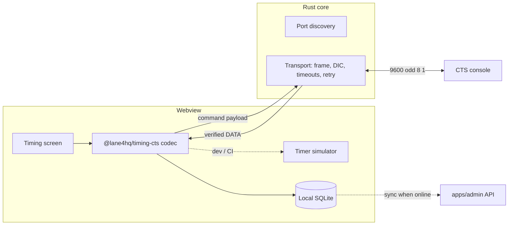

# Desktop timing companion v1: spec

> **Status:** built (2026-09-29). Codec and simulator are in `packages/timing-cts`, serial transport in `apps/desktop/src-tauri/src/timing/`, and the meet workflow in `packages/meet-engine`. Departures from this spec are recorded in [ADR 0003, Implementation notes](../adr/0003-cts-timing-interface-split.md#implementation-notes) and [ADR 0004](../adr/0004-offline-meet-store-and-publishing.md): local storage is atomic JSON rather than SQLite, and team packs are HY3-only for now. Hardware validation ([#74](https://github.com/JamesSingleton/lane4-hq/issues/74)) is still open.

Related:

- [Desktop roadmap](desktop-roadmap.md), milestone 2
- [ADR 0001: Tauri](../adr/0001-tauri-for-desktop.md)
- [ADR 0002: the desktop app is for running meets](../adr/0002-desktop-is-for-running-meets.md)
- [ADR 0003: CTS transport / codec split](../adr/0003-cts-timing-interface-split.md)

## Problem

At a meet, race results live on the timing console. Getting them into Lane4 today means Hy-Tek Meet Manager and a results export after the session, then an import into admin. A coach or meet director running the meet from Lane4 needs results pulled straight from the console, race by race, with no network required.

## Goals (v1)

1. Connect to a Colorado Time Systems console (System 6, System 5, 4000A, Gen7) over RS232 or USB-serial, on **macOS and Windows**.
2. Pull finished races (read-only): place, final time, splits, backup and individual button times, and relay exchange judging.
3. Match each race to a Lane4 meet event, heat, and lane, and show it for review before accepting.
4. Store accepted results locally first. Sync them to `apps/admin` when online, and export them to Hy-Tek formats.
5. Develop and test entirely without hardware, using a timer simulator.

## Non-goals (v1)

- Writing setups to the timer (`I…` commands: event sequences, labels, pool setup). See "Risks".
- Scoreboard control, printing, or start-system integration.
- Timing systems from other vendors (Daktronics, Omega). The transport and codec layout should allow them later.
- Host-side entry merge.

## CTS meet management interface

Summarized from Colorado Time Systems, *System 6, System 5 & 4000A Swimming Meet Management Interface With Gen7 Notes* (F397 Rev. F). The vendor PDF is **not committed** to this repo until CTS redistribution terms are confirmed; ask the maintainer for a copy. Everything below is a paraphrased summary for implementation planning.

### Model

- The timer is a queryable database of **meets**. It starts a new meet on every power-up.
- System 5 and 4000A keep a fixed number of meets. The oldest meet is discarded first, and only meets with races are returned.
- A **meet pointer** selects the meet being queried:
  - `M-` moves to the previous meet and wraps from the oldest to the newest.
  - `M+` moves to the next meet and stops at the newest (v1.03+), returning an error beyond it.
- Races are stored oldest to newest. The oldest race is dropped when memory fills (around 500 races on a System 5, around 150 on a 4000A).
- Races can be addressed by event and heat (only stored when the timer ran in print-in or title mode), by race number, or by moving a race pointer (last or next).

### Physical link

- **9600 baud, odd parity, 8 data bits, 1 stop bit**, no handshake. The timer is a DCE and only uses TX (pin 2), RX (pin 3), and GND (pin 5). The handshake lines are looped back inside the timer.
- Only the timer's **top RS232 port (COM 1)** speaks this protocol.
- Most modern machines need a USB-serial adapter, possibly with an FTDI or Prolific driver. It appears as `COMn` on Windows and `/dev/cu.usbserial-*` on macOS. Prefer `cu.*` over `tty.*` on macOS, because `tty.*` blocks on carrier detect.

### Framing

```
| NUM (2) | DATA (NUM-4) | DIC (2) |
```

- **NUM:** the total packet length (NUM + DATA + DIC), 16-bit little-endian.
- **DIC:** `0xFFFF` minus every byte of NUM and DATA, 16-bit, sent little-endian.
- **Multi-byte values:**
  - 16-bit words are little-endian.
  - 32-bit values are low word then high word, which is also little-endian.
- **Response rules:**
  - A 5-byte response is the smallest valid one.
  - A 6-byte response is an **error code** (a 16-bit word), except the response to `Rg` (read splits setup).
  - Anything under 5 bytes is a line error.
  - The ACK for writes is `06 00 06 00 F3 FF`, meaning code `0x0006`.
- **Golden vectors** (from the vendor doc):

| Meaning | Bytes |
|---|---|
| `W` (who are you) | `05 00 57 A3 FF` |
| `S` (swim data, race at pointer) | `05 00 53 A7 FF` |
| ACK | `06 00 06 00 F3 FF` |
| Response to `Rr` (selected event sequence = 7) | `05 00 07 F3 FF` |

### Timing

- Every byte of a packet must be sent within **50 ms** of the previous byte. When the timer sees a bad packet, it ignores that packet and anything else arriving in the next 50 ms.
- The timer starts its response within **500 ms**. If no first byte arrives in 500 ms, **re-send** the command.
- Once the first byte of a packet arrives, the rest must arrive within **500 ms**.

### Commands used in v1

| Command | Bytes | Response |
|---|---|---|
| Who are you | `W` | Null-terminated version string, 20 chars max |
| Meet time/date | `T` | Race header; only the `date_*` fields are valid |
| Next / previous meet | `M+` / `M-` | Same as `T`, or an error (51 = already at newest) |
| Swim data | `S` + options + selector | Race header + lane data, or an error (50 = no race) |

`S` options:

- These must come first, in any combination: `B` (include backup), `S` (include splits), `I` (include individual buttons, v3.1+), `J` (include relay judging, v3.1+), `X` (include reaction times, System 6 v1.109+ only).
- Then **one** selector:
  - `L`: last race.
  - `N`: next race.
  - `C`: current race. **Not supported on Gen7.**
  - `E#$`: heat `#`, event `$`, both 1 byte. For events above 255 on v3.1+, send `E # 00 <event u16 LE>`.
  - `R##`: race number, u16 LE.
- With no selector, the timer returns the race at the pointer.

v1 addressing strategy: walk races with `L`/`N` and fetch by `R##`, so it works on Gen7. Use `E#$` when the timer was run with event and heat titles.

### Race response layout

The header (`TYPE_MEETMGMT_HEADER`), in order:

1. `event`, `heat`: 1 byte each. `event` is 0 when the event number is above 255; use `event_16_bit` instead.
2. `include_backup`, `include_splits`: flags.
3. `race_number`: `int`.
4. Race date, 1 byte each:
   - `seconds`, `minutes`;
   - `hours` (0–23);
   - `weekday` (0 = Sunday);
   - `month` (1–12);
   - `day` (1–31);
   - `year` (0–99).
5. Race shape: `race_lengths`, `lanes_in_pool` (lanes sending), `num_times_for_each_lane` (includes backups).
6. `reserved1[MAX_NUM_LANES+1]`, `reserved2[MAX_NUM_LANES+1]`.
7. `date_long_year`: `int`, 1990–2089, v3.25+. Reserved on older firmware.
8. `ireserved2`: `int`.
9. On v3.1+:
   - `event_16_bit` (`int`, 0–999);
   - `include_individual_buttons`, `include_relay_judging`, `number_of_buttons` (1 byte each).

Then, for each lane from 1 to `lanes_in_pool`:

- **place:** i8. `-1` means DQ, `0` means no finish, and 1–10 are places.
- **splits:** u32 thousandths each. **The last split is the final time.**
- **individual button times:** u32 each, if requested. Not sent when only one backup button was used.
- **backup time:** u32, if requested.
- **relay judging:** exchanges 1 to n-1, as i16 thousandths. Negative means an early takeoff.

**Must confirm on hardware before calling the codec stable:**

- the width of `int` (assumed 2 bytes little-endian, since this is 16-bit firmware);
- the value of `MAX_NUM_LANES` (assumed 10);
- how split count relates to `race_lengths` and to `num_times_for_each_lane`.

The codec should check that computed lengths match `NUM` exactly, and fail loudly otherwise.

### Error codes

| Code | Meaning |
|---|---|
| 50 | No race matches the request (pre-v3.1 firmware returns 0) |
| 51 | Already at the newest meet |
| 100 / 101 / 102 | Setups write refused: timer in SETUPS menu / remote setups disabled / timer not reset |
| 200–248 | Invalid field in a setups write (the sub-command itself was valid) |
| 300 / 301 | Invalid write / read setups sub-command |

### Gen7 notes

- `S` + `C` (current race) is not supported.
- Setups **read** sub-commands supported: `g` (splits), `i` (pool), `r` (event sequence select), `s` (event sequence label).
- Setups **write** sub-commands supported: `r`, `s`, `t`, `u`.
- v1 only needs `Ri`, to read pool setup: lane count, course, and units. It uses that to sanity-check against the Lane4 meet.

## Design



- **Rust transport** (`src-tauri/src/timing/`):
  - Commands:
    - `timing_list_ports()`: returns name, USB VID/PID, and a friendly label.
    - `timing_open(port)` and `timing_close()`.
    - `timing_request(data: Vec<u8>) -> Result<Vec<u8>, TransportError>`.
  - `TransportError` is one of `Timeout`, `BadChecksum`, `ShortPacket`, `Io`, or `TimerError(u16)`.
  - One request is in flight at a time. Retry on response timeout up to 3 times, with a 50 ms quiet gap before each retry.
  - Built on the `serialport` crate. Unit tests cover framing and DIC with the golden vectors, and there is a mock-port integration test.
- **`@lane4hq/timing-cts`** (a new TS package, no Tauri dependency):
  - `encodeCommand()` and `decodeRace(bytes, options) -> TimerRace`.
  - `decodeError(code)`.
  - A `TimerClient` interface, implemented by the Tauri transport and by `createSimulator(fixtureRaces)`.
  - It needs 100% coverage, like `swim-formats`. Golden fixtures live in `packages/timing-cts/fixtures/` and start with the vendor vectors above.
- **Timing screen (desktop):**
  - A port picker that remembers the last port.
  - A connection status panel showing the `W` version string and the meet date from `T`.
  - A race list: new races appear as the operator finishes them, pulled by polling `N` from the last known race number every 2 s while connected.
  - Each race opens a review panel showing lanes, the Lane4 entry for each lane (by event, heat, and lane), the timer place and time, backups, splits, and DQ.
  - The operator **accepts** or **edits** each race before it becomes an official result.
- **Matching:**
  - Use the race's `event_16_bit` (or `event`) and `heat` against the Lane4 meet's heat sheet.
  - When the timer wasn't titled, the operator assigns the race to an event and heat, and later races auto-advance from there.
- **Storage and sync:**
  - Accepted races are written to local SQLite along with the raw timer bytes (for audit and re-decoding).
  - They publish to admin through the meet API (roadmap milestone 2, [ADR 0002](../adr/0002-desktop-is-for-running-meets.md)) with an idempotency key of timer serial/version, meet date, and race number.
  - They can also be exported to HY3 or CL2 results through `@lane4hq/swim-formats/export`.

## Distribution

- **macOS:**
  - Universal `.dmg`, signed with an Apple **Developer ID Application** certificate and **notarized** with `notarytool` (hardened runtime).
  - Serial access needs no extra entitlement outside the App Sandbox. The app isn't sandboxed (it isn't distributed through the Mac App Store).
- **Windows:**
  - NSIS installer plus MSI, signed with **Authenticode**. Azure Trusted Signing is preferred over an EV certificate, for cost and CI friendliness.
  - WebView2 is installed through the bootstrapper.
- **Updates:** `tauri-plugin-updater` with a signed update manifest on GitHub Releases.
- **Release workflow:** a tag `desktop-v*` builds on macOS and Windows runners, then signs, notarizes, drafts a GitHub Release, and publishes the updater JSON. PR builds stay unsigned (`.github/workflows/desktop.yml`).

## Risks

- **Stored-title corruption:** timer race titles are built from shared label tables at display time. Rewriting labels (`It`) retroactively changes the titles of every stored race that uses them. v1 never writes setups. If writes are ever added, they must follow the vendor's read–modify–write–verify procedure, only fill empty label slots, and warn the operator first.
- **Undocumented widths:** see "Must confirm on hardware" above. Budget time with a real System 5 or Gen7 console before release.
- **Adapters and cables:** adapter quality varies and drivers can be missing. The UI should show clear "no response from timer" guidance: check that it's the top port, that the timer is on, and the cable type.
- **Memory rollover:** the timer drops its oldest races when full. The companion should pull races promptly and never assume the timer is the long-term record.

## Open questions

1. Should Lane4 also interoperate with Hy-Tek Meet Manager? That would mean reading or writing MM's backup or database folder, or feeding results through CL2/HY3 files, or only exchanging files. Default for v1: Lane4 only, with HY3/CL2 export for MM users.
2. Which consoles can we get for testing (System 5? Gen7?), and which firmware versions?
3. Should reaction times (`X`, System 6 only) show in v1 review, or be stored silently?

## Issue breakdown

These issues are created with `needs-triage`. Suggested order:

1. [#69](https://github.com/JamesSingleton/lane4-hq/issues/69): `timing-cts` codec. Framing and DIC helpers, command encoders, race and error decoders, golden tests from the vendor vectors.
2. [#70](https://github.com/JamesSingleton/lane4-hq/issues/70): timer simulator implementing `TimerClient`, driven by fixture races.
3. [#71](https://github.com/JamesSingleton/lane4-hq/issues/71): Rust serial transport. Port discovery, framing/DIC/timeouts/retry, Tauri commands, and unit tests.
4. [#72](https://github.com/JamesSingleton/lane4-hq/issues/72): timing screen. Port picker, connection status, race list polling, and a race review panel against the simulator.
5. [#73](https://github.com/JamesSingleton/lane4-hq/issues/73): race → Lane4 heat-sheet matching, plus local result storage.
6. [#74](https://github.com/JamesSingleton/lane4-hq/issues/74): hardware validation session. Confirm header widths, `MAX_NUM_LANES`, and split counts on a real console.
7. [#75](https://github.com/JamesSingleton/lane4-hq/issues/75): desktop signing, notarization, updater, and tagged release workflow.
